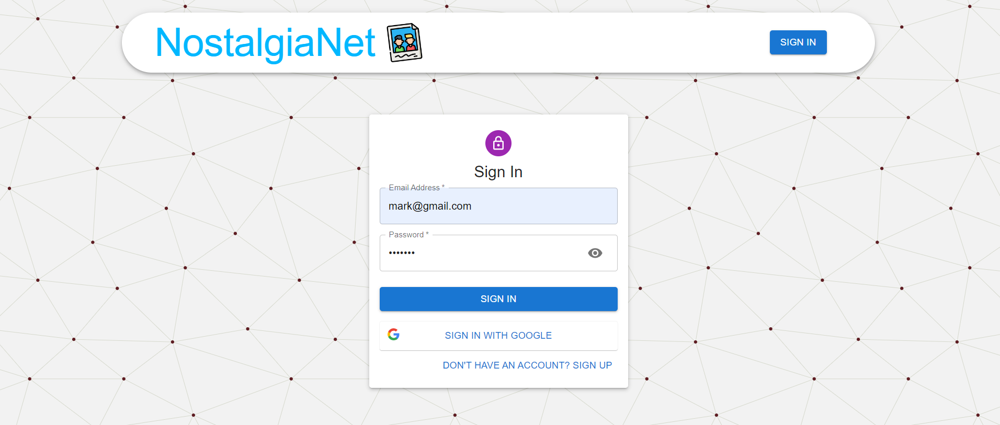

# NostalgiaNet

NostalgiaNet is a full-stack web application that aims to preserve and share nostalgic moments through a user-friendly and scalable platform. The project utilizes the MERN stack—MongoDB, Express, React, and Node.js—to provide a robust backend and a dynamic frontend.

- **Frontend**: Built with React and styled using Material UI for a responsive and intuitive user interface.
- **Backend**: Implemented with Node.js and Express, providing a secure and efficient server-side architecture.
- **State Management**: Utilizes Redux-Toolkit for centralized state management, enhancing scalability and maintainability.
- **Database**: MongoDB with Mongoose ORM ensures reliable data storage and retrieval.
- **Authentication**: Implements JWT-based authentication for email login and integrates Firebase for Google Sign-In, ensuring secure user authentication.
- **Deployment**: Frontend deployed on [Vercel](https://nostalgia-net-frontend.vercel.app/), backend deployed on [Vercel](https://nostalgia-net-backend.vercel.app/), ensuring continuous availability and scalability.

## Features

- **Authentication**: Users can securely log in using email or opt for Google Sign-In via Firebase.
- **CRUD Operations**: Users can create, update, and delete their posts, with additional functionalities such as liking other users' posts.
- **Responsive UI**: Single-page application design with a responsive user interface, ensuring a seamless experience across devices.

## Screenshots


*Displaying all posts; logged-in users can edit or delete their posts.*


*User authentication with email or Google Sign-In.*


*New user registration options: email or Google Sign-Up.*


*Authorized users can edit their posts using the options menu.*

## Getting Started

To get a local copy up and running follow these simple steps.

### Prerequisites

- Node.js installed locally
- MongoDB database instance (local or cloud-based)

### Installation

1. Clone the repository:
```bash
git clone https://github.com/vekariyasagar54/NostalgiaNet.git
```
2. Install npm dependencies in the client directory:

```bash
cd client
npm install
```

3. Install npm dependencies in the server directory:

```bash
cd server
npm install
```

### Usage
1. Start the backend server:

```bash
cd server
npm start
```
2. Start the frontend development server:
```bash
cd client
npm start
```
3. Open http://localhost:3000 in your browser to view the application.

## References

- [React Documentation](https://reactjs.org/docs/getting-started.html)
- [Redux Toolkit Quick Start](https://redux-toolkit.js.org/tutorials/quick-start)
- [Material-UI Documentation](https://mui.com/material-ui/getting-started/overview/)
- [Mongoose Guide](https://mongoosejs.com/docs/guide.html)
- [JWT Documentation](https://jwt.io/)
- [Firebase Documentation](https://firebase.google.com/docs)
- [Node.js Documentation](https://nodejs.org/en/docs/)
